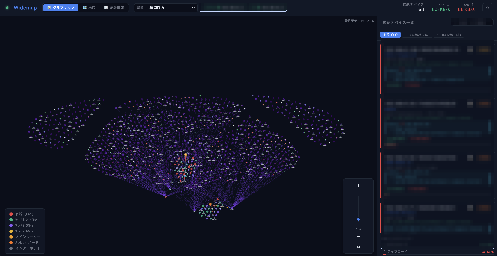
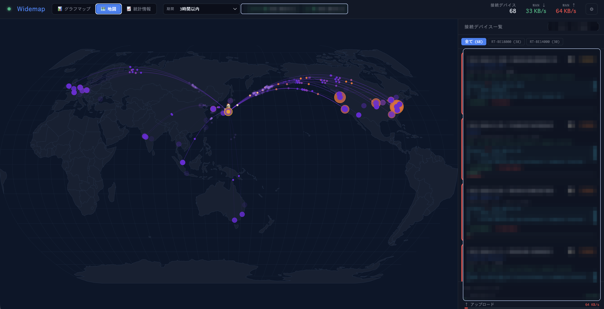
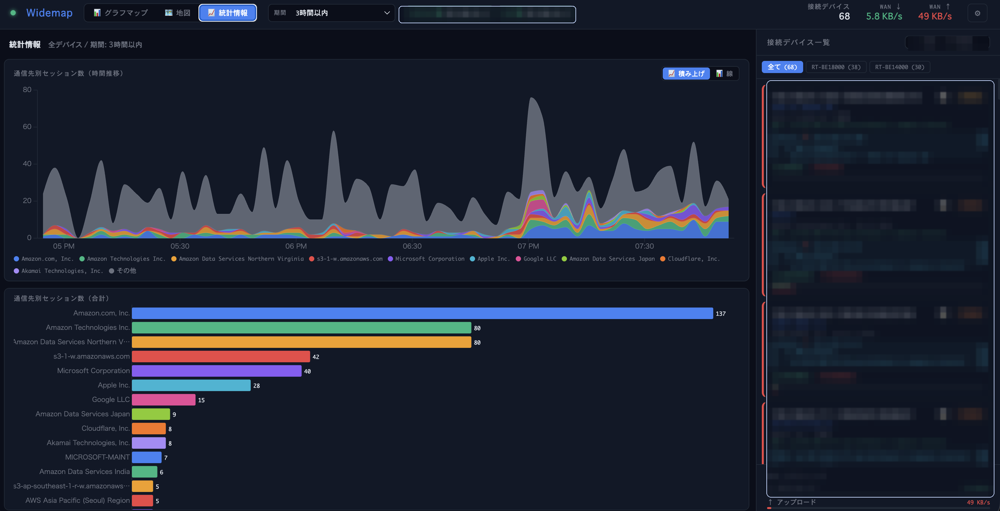

# Widemap

**家庭・SOHO向けネットワークセキュリティモニター — LAN内の全デバイスの通信先をリアルタイムに可視化**

スマートTVが見知らぬサーバーと通信していないか？IPカメラやIoT機器、NASが許可していない接続をしていないか？Wideemapは、LAN内の全デバイスが外部と行う通信を**パッシブに監視**し、リアルタイムに世界地図上で可視化します。脅威フィードとの自動照合、Slack通知に対応。

追加ハードウェア不要。通信の中継・傍受も不要。既存のYamaha RTXルーターのNATセッションテーブルを読み取るだけで動作します。


> 🇬🇧 [English README](README.md) | 🌐 [プロジェクトページ](https://yo1t.github.io/widemap/index.ja.html)

---

## 家庭・SOHOのセキュリティ対策として

現代の家庭やSOHOネットワークには、スマートTV・IPカメラ・NAS・Wi-Fiスピーカー・プリンター・ネットワーク機器・PC・スマートフォンなど、20〜40台以上のデバイスが接続されています。IoT機器の多くはファームウェア更新が不定期で、どこに通信しているか把握されていません。一度侵害されると、C2サーバーへのデータ流出やボットネットへの加担が、ユーザーに気づかれないまま進みます。

Wideemapは、多くの家庭ユーザーが答えを持てていない問いに答えます：**自分のネットワーク上の各デバイスは、今どこと通信しているのか？**

- **パッシブ・ゼロインパクト監視** — ルーターのNATセッションテーブルをSSHで読み取るだけ。通信の中継・傍受なし、スループット低下なし
- **デバイス単位の可視性** — OUI・mDNS・SSDP・NetBIOSによるデバイス識別で、どの機器が何と通信しているかを把握
- **自動脅威検出** — Feodo Tracker・ThreatFox・URLhaus・Spamhaus DROPとリアルタイムに全接続を照合
- **即時Slackアラート** — 任意のデバイスが既知のC2サーバーやマルウェア配布元に接続した瞬間にDM通知
- **ハードウェア変更不要** — Mac・PC・Raspberry Piにインストールするだけ。既存のYamaha RTXルーターと共存

## 概要

- **Yamaha RTX** ルーターにSSH接続し、NATセッションテーブルを60秒ごとに取得
- **[INSPECT] syslog 補完** — Yamaha syslog をリアルタイムで監視し、60秒ポーリングの間に完了した短命 TCP セッションを補完
- **dnsmasq DNS クエリログ** — EC2/サーバー側の dnsmasq ログを監視し、デバイスごとの DNS 解決結果（例: `data.meethue.com`）を宛先ホスト名に反映。逆引き DNS より優先
- **[DHCPD] syslog 追跡** — Yamaha の DHCP イベント（Allocates/Extends）をリアルタイムで解析し、IP→MAC マッピングを維持
- **脅威インテリジェンス**: Feodo Tracker、ThreatFox、URLhaus、Spamhaus DROP フィードと全接続を突合（1時間ごと自動更新）
- **Slack通知**: 脅威検出時に Slack DM で通知（クールダウン設定・言語対応）
- **OUIベンダー検索**、**mDNS/Bonjour**、**SSDP**、**NetBIOS**、**Appleモデル辞書**でデバイスを自動識別（「iPhone 15 Pro」レベルまで特定）
- 各接続先IPに対して**逆引きDNS**、**RDAP**（組織名）、**GeoIP**（緯度経度・都市）を自動付与
- インタラクティブな**世界地図**上にアニメーション付きアークで全接続をプロット
- オプションで**ASUS WiFi アクセスポイント**（APモード/AiMeshとして使用、ルーターとしてではない）に接続し、WiFiクライアント情報（帯域、信号強度、トラフィック量、AiMeshトポロジー）を取得
- **接続履歴**を**SQLite**で永続保存（WALモード、クラッシュセーフ、最大2年保持可）
- **通信ログ**: ソート・検索可能なセッション一覧（脅威バッジ・詳細ポップアップ付き）
- **📡 データソースタブ** — dnsmasq・[INSPECT]・[DHCPD] の ON/OFF とパスを設定画面から個別に制御
- ダークテーマのシングルページUI（グラフビュー、地図ビュー、統計ビュー、通信ログ）

## デモ

https://github.com/user-attachments/assets/9360b145-60cb-46b1-8489-898d7ea62b60

> UI言語: 英語 / 日本語 切り替え可能

収集したNATセッション情報をもとに、ネットワークグラフ・世界地図上の通信アーク・時系列トレンドチャートをリアルタイムに表示します。

右側のサイドバーにはLAN内の全デバイスが一覧表示され、IPアドレスやMACアドレスに加えてホスト名・ベンダー名・機種名などを自動収集して表示します。デバイスを選択すると、そのデバイスの通信先だけにフィルタされ、地図やグラフに反映されます。

## スクリーンショット





## アーキテクチャ

```
┌─────────────────┐  SSH(NAT)   ┌──────────────────────┐
│  Yamaha RTX     │◄───────────►│                      │
│  [INSPECT] log  │  syslog/UDP │   Widemap Server     │  WebSocket
│  [DHCPD] log    │────────────►│   (Node.js)          │◄──────────► ブラウザ
└─────────────────┘             │                      │
┌─────────────────┐  HTTP       │  ポーラー:            │
│  ASUS WiFi AP   │◄───────────►│  • yamaha (SSH)      │
│  (クライアント)   │             │  • asus (HTTP)       │
└─────────────────┘             │  • inspect-syslog    │
┌─────────────────┐  tail -F    │  • dhcpd-syslog      │
│  dnsmasq        │────────────►│  • dnsmasq-log       │
│  クエリログ      │             └──────────┬───────────┘
└─────────────────┘                        │
                       ┌───────────────────┼───────────────┐
                       │                   │               │
                 ┌─────┴──────┐  ┌─────────┴───┐  ┌───────┴───┐
                 │エンリッチ   │  │ 脅威インテル  │  │  SQLite   │
                 │ • dnsmasq  │  │ • Feodo      │  │  履歴     │
                 │ • 逆引DNS  │  │ • ThreatFox  │  │  (WAL)    │
                 │ • RDAP     │  │ • URLhaus    │  └───────────┘
                 │ • GeoIP    │  │ • DROP       │
                 │ • OUI      │  └─────────────┘
                 │ • mDNS     │
                 └────────────┘
```

## 動作要件

- **Node.js** 18以上
- **Yamaha RTX** ルーター（SSH有効化済み）— RTX1200, RTX1210, RTX1220, RTX1300 等
- （任意）**ASUS WiFi アクセスポイント**（Web管理画面が有効、APモード/AiMeshとして使用）

## クイックスタート

### Step 1 — 事前準備チェックリスト

| | 必要なもの | 設定ガイド |
|--|-----------|-----------|
| ✅ | Mac/PC/Raspberry Pi に Node.js 18以上をインストール | [nodejs.org](https://nodejs.org) |
| ✅ | Yamaha RTX ルーターの SSH を有効化 | [設定ガイド →](docs/setup-yamaha.ja.md) |
| ☐ | （任意）ASUS WiFi AP の Web 管理画面を有効化 | [設定ガイド →](docs/setup-asus.ja.md) |

### Step 2 — インストールと起動

```bash
git clone https://github.com/yo1t/widemap.git
cd widemap
npm install
npm start
```

### Step 3 — ブラウザを開いて管理トークンを入力

初回起動時に**管理トークン**がコンソールに表示されます：

```
══════════════════════════════════════════════════════════════
  Widemap admin token (initial):
  a1b2c3d4e5f6...
  → ブラウザ初回アクセス時にこのトークンを入力してください
══════════════════════════════════════════════════════════════
```

`http://localhost:3000` を開いてトークンを入力してください。

### Step 4 — ルーターの接続情報を設定

設定パネル（⚙）を開いてルーター情報を入力します：

| 項目 | 確認場所 |
|------|---------|
| Yamaha RTX の IP アドレス | ルーターの LAN 側 IP（例: `192.168.1.1`） |
| SSH ユーザー名 / パスワード | [Yamaha 設定ガイド](docs/setup-yamaha.ja.md) で設定したもの |
| NAT ディスクリプタ番号 | ルーターで `show nat descriptor` を実行 — 通常は `100` |
| ASUS AP の IP / パスワード | AP の LAN 側 IP と管理者パスワード（[ASUS 設定ガイド](docs/setup-asus.ja.md)） |

数秒後にデバイスと接続先が地図に表示されはじめます。

> **注意:** 管理トークンは初回起動時に1度だけ生成され、`.widemap.json` に保存されます。紛失した場合は `.widemap.json` を削除して再起動すれば新しいトークンが生成されます。

## 管理トークン

管理トークンは全APIエンドポイントとWebSocket接続を保護します。ブラウザUIを開くたびに入力が必要です。

### トークンの確認方法

1. **初回起動時** — 上記のようにコンソール（stdout）に表示されます
2. **起動後** — `.widemap.json` に保存されています（フィールド: `adminToken`）

### トークンを紛失した場合

```bash
# 方法1: 設定ファイルから読み取る
cat .widemap.json | grep adminToken

# 方法2: リセット（新しいトークンが生成される）
rm .widemap.json
npm start
```

### 仕組み

- ブラウザは初回アクセス時にトークンの入力を求め、`localStorage` に保存します
- 全APIリクエストは `X-Admin-Token` ヘッダーにトークンを含めます
- WebSocket接続はSocket.IOのハンドシェイク認証でトークンを渡します
- トークン比較には `crypto.timingSafeEqual` を使用し、タイミング攻撃を防止します

## 設定

設定は `.widemap.json`（自動生成、gitignore対象）に保存されます。環境変数でも指定可能：

| 変数 | デフォルト | 説明 |
|------|-----------|------|
| `PORT` | `3000` | HTTPサーバーポート |
| `POLL_INTERVAL_MS` | `2000` | ASUSポーリング間隔（ミリ秒） |
| `ROUTER_IP` | `192.168.1.1` | ASUSルーターのデフォルトIP |
| `YAMAHA_IP` | — | Yamaha RTXのIPアドレス |
| `YAMAHA_USER` | — | Yamaha SSHユーザー名 |
| `YAMAHA_PASS` | — | Yamaha SSHパスワード |
| `YAMAHA_NAT` | `100` | NATディスクリプタ番号 |
| `SUBPATH` | — | リバースプロキシのサブパス（例: `/widemap`） |

## 機能詳細

### L3/L4: Yamaha RTX（NATセッション監視）

- `show nat descriptor address <N> detail` の出力をパース
- TCP/UDP/ICMP/GRE セッションを送信元・宛先・ポート・TTL付きで追跡
- SSHタイムアウト・切断時の自動再接続
- TOFU（Trust On First Use）によるホスト鍵検証

### L2: ASUS WiFi アクセスポイント（Mesh対応、クライアント監視）

ASUSデバイスは**WiFiアクセスポイント（APモードまたはAiMesh）**として使用します。L3ルーティングとNATはYamaha RTXが担当し、ASUS APはL2のクライアント可視性を提供します：

- SHA256チャレンジレスポンス認証
- クライアント一覧（接続種別: 有線/2.4G/5G/6G、RSSI、トラフィック量）
- AiMeshノード検出（マルチAPトポロジー）
- トークン自動更新

### デバイス識別

- **OUIデータベース**（Wireshark manuf、週次自動ダウンロード）
- **mDNS/Bonjour** サービス探索（100種類以上のサービスタイプ）
- **SSDP/UPnP** デバイス検出
- **NetBIOS** 名前解決
- **Appleモデル辞書**（200機種以上: iPhone, iPad, Mac, Apple TV, HomePod, Apple Watch）
- **自動調査モード**: 未知のデバイスをバックグラウンドでスキャン

### 可視化

- **グラフビュー**: 力学モデルによるネットワークトポロジー
- **世界地図**: 接続先IPを緯度経度にプロットし、設置場所からアニメーションアークを描画
- **統計**: 接続先別セッション数の時系列チャート・棒グラフ
- **通信ログ**: 全セッションのテーブル表示（カラムごとのソート・検索フィルター対応、脅威行のクリックで詳細ポップアップ）
- **接続パネル**: デバイスごとのアクティブなインターネット接続一覧（組織名・国情報付き）
- **IPv4/IPv6バッジ**: NDPキャッシュポーリングによるプロトコル検出

### 脅威インテリジェンス（C2/ボットネット検出）

- **Feodo Tracker**: Emotet/Dridex/TrickBot C2サーバーIP
- **ThreatFox**: マルウェアIOC（IP:port）
- **URLhaus**: マルウェア配布URL（GitHub等のCDNドメインは低信頼度として区別）
- **Spamhaus DROP**: ハイジャック済みIP範囲（CIDR）
- 3段階の信頼度: 🚨 検出（高信頼度） / ⚠️ 要確認（低信頼度 — 正規サービス上） / ✅ 未検出
- 脅威詳細ポップアップ（信頼度に応じた推奨アクションを表示）
- フィード自動更新（1時間ごと、設定で変更可能）

### Slack通知

- 脅威検出時に **Slack DM** で即時通知
- 同一宛先への再通知クールダウン設定（デフォルト1時間）でスパムを防止
- UI言語設定に連動してメッセージを日本語/英語で送信
- 設定画面のテスト送信ボタンで設定確認可能
- Slack Bot TokenとユーザーID（`U01XXXXXXX`）が必要 — 設定 → 脅威検出タブから設定

### セキュリティ

- 管理トークン認証（タイミングセーフ比較）
- SSRF防止（プライベートIP範囲のみ許可）
- Socket.IO 同一オリジン制限
- SSHホスト鍵フィンガープリント検証（TOFU）
- 設定ファイルは `0600` パーミッションで保存
- パスワードはブラウザに送信しない（真偽値フラグのみ）

## 対応ルーター

### Yamaha RTX（L3/L4）
SSH接続とNATディスクリプタに対応した全モデル：
- RTX1200, RTX1210, RTX1220, RTX1300
- RTX810, RTX830
- NVR500, NVR510, NVR700W

### ASUS WiFi アクセスポイント（L2、Mesh対応）
標準Web管理インターフェースを持つ全モデル（APモードまたはAiMeshで使用）：
- RT-AXシリーズ（AX86U, AX88U, AX92U 等）
- RT-ACシリーズ
- ZenWiFi（AiMesh）

## ライセンス

Widemap はデュアルライセンスです。

- オープンソースライセンス: [GNU Affero General Public License v3.0](LICENSE)
- 商用ライセンス: プロプライエタリ利用・クローズドソース利用向けに別途提供

AGPL-3.0 の条件に従う限り、Widemap を利用・改変・配布できます。Widemap またはその派生物をプロプライエタリ製品に組み込む場合、ソースコードを公開せずに配布する場合、または改変版をネットワークサービスとして提供する場合は、AGPL-3.0 のソースコード提供義務を遵守する必要があります。

AGPL-3.0 に基づく対応するソースコード公開を行わずに、Widemap をプロプライエタリまたはクローズドソースの商用製品で利用したい場合は、著作権者から商用ライセンスを取得する必要があります。

```
Widemap — リアルタイムネットワーク接続可視化ツール
Copyright (C) 2025 Yoichi Takizawa

ソースコード: https://github.com/yo1t/widemap
```

## コントリビュート

Issue や Pull Request を歓迎します。大きな変更の場合は、先に Issue で相談してください。
